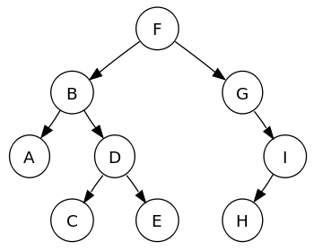

Another blog post in response to a StackOverflow question. It’s about LINQ again, but it’s no as low-level as the one from previous post. This time the question is quite simple: [How to search Hierarchical Data with Linq](http://stackoverflow.com/q/18165460/1163867).

<!--more-->

To answer the question, let’s start with some sample data we could fight against, starting with Person class:

```csharp
public class Person
{
    public string FirstName { get; set; }
    public string LastName { get; set; }
    public List<Person> Children { get; set; }
}
```

And a tree-like structure with just one root element and some leafs:



Here is a little bit more developer-friendly representation of the structure above:

```csharp
var Jon = new Person
{
    FirstName = "Jon", LastName = "F",
    Children = new List<Person>() {
        new Person  {
            FirstName = "Amy", LastName = "B",
            Children = new List<Person>() {
                new Person {
                    FirstName = "Mary", LastName = "A"
                },
                new Person {
                    FirstName = "Scott", LastName = "D",
                    Children = new List<Person>() {
                        new Person {
                            FirstName = "Jon", LastName = "C"
                        },
                        new Person {
                            FirstName = "Gordon", LastName = "E"
                        }
                    }
                }
            }
        },
        new Person {
            FirstName = "Bob", LastName = "G",
            Children = new List<Person>() {
                new Person {
                    FirstName = "Drew", LastName = "I",
                    Children = new List<Person>() {
                        new Person {
                            FirstName = "Amy", LastName = "H",
                        }
                    }
                }
            }
        }
    }
};
```

It’s time to do some really programming now. First of all, we need a way to traverse whole tree, one node after another. But there are three requirements that should be met by the Traverse method:

- It has to be as generic as possible – making it work only with Person class would make it a bit useless.
- It has to read and return one element at the time, like other LINQ methods.
- User has to be able to specify a [traverse type](http://en.wikipedia.org/wiki/Tree_traversal#Types) – the same input can return different results for different traverse types.

The extension method itself is quite simple:

```csharp
public static IEnumerable<T> Traverse<T>(this T source, Func<T, IEnumerable<T>> childrenSelector, TraverseType type)
{
    if (childrenSelector == null)
    {
        throw new ArgumentNullException("childrenSelector");
    }

    switch (type)
    {
        case TraverseType.PostOrder:
            return TraversePostOrder(source, childrenSelector);
            break;
        case TraverseType.PreOrder:
            return TraversePreOrder(source, childrenSelector);
            break;
        default:
            throw new ArgumentException("Unknow TraverseType specified.", "type");
    }
}
```

The internal implementations aren’t complicated either:

```csharp
private static IEnumerable<T> TraversePreOrder<T>(T source, Func<T, IEnumerable<T>> childrenSelector)
{
    // return current node itself
    yield return source;
    // run TraversePreOrder on children collection
    foreach (T child in TraversePreOrder(childrenSelector(source), childrenSelector))
        yield return child;
}

private static IEnumerable<T> TraversePreOrder<T>(IEnumerable<T> source, Func<T, IEnumerable<T>> childrenSelector)
{
    // check if collection is null to avoid ArgumentNullException thrown from SelectMany
    if (source == null)
        yield break;

    // call TraversePreOrder on every collection item
    foreach (T child in source.SelectMany(c => TraversePreOrder(c, childrenSelector)))
        yield return child;
}

private static IEnumerable<T> TraversePostOrder<T>(T source, Func<T, IEnumerable<T>> childrenSelector)
{
    // run TraversePostOrder on children collection
    foreach (T child in TraversePostOrder(childrenSelector(source), childrenSelector))
        yield return child;

    // return current node itself
    yield return source;
}

private static IEnumerable<T> TraversePostOrder<T>(IEnumerable<T> source, Func<T, IEnumerable<T>> childrenSelector)
{
    // check if collection is null to avoid ArgumentNullException thrown from SelectMany
    if (source == null)
        yield break;

    // call TraversePostOrder on every collection item
    foreach (T child in source.SelectMany(c => TraversePostOrder(c, childrenSelector)))
        yield return child;
}
```

And an example of usage:

```csharp
var family = Jon.Traverse(x => x.Children, MyEnumerable.TraverseType.PreOrder)
```

I’m gonna end with a trivia question: What’s the difference between the two traverse types? The first one returns current node before going into its children. The second one go down the structure first and then returns current node. Why is the difference important? Consider following piece of code:

```csharp
var postJon = Jon.Traverse(x => x.Children, MyEnumerable.TraverseType.PostOrder).First().LastName;
var preJon = Jon.Traverse(x => x.Children, MyEnumerable.TraverseType.PreOrder).First().LastName;
```

The first one returns A, while the second one returns F. See the difference now? If not, check [traverse diagram](http://en.wikipedia.org/wiki/Tree_traversal#Types) on wikipedia.